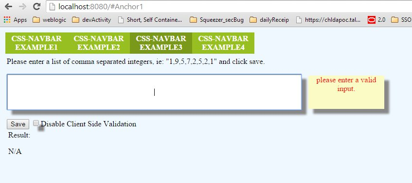

DevActivity
===========

#Introduction

DevActivity is a demo spring boot application that offers a Ajax/Rest html interface to solve the following problem:

>Given: N integers separated with a semicolon (duplicates are allowed). 
>Remove the duplicates from the given list and find the (N/3)-th largest element in the modified list. 

>Example: 
>List of integers: 1;9;5;7;2;5;2;1.
>Length of the list N is 8, so N/3 is 2. Second largest element must be found. When duplicates are removed, 
>the list becomes 1;9;5;7;2. Therefore, the answer is 7, because 7 is the second largest element in the 
>modified list.

#Compiling from sources:

To compile you need Maven3 and a JDK 1.7 installed and configured in your system.
To install maven you can follow theses instruction here:  http://maven.apache.org/download.cgi#Installation

1. Download or clone the sources from github at https://github.com/Wiwun/DevActivity
2. Open a shell in DevActivity/reactor folder  and run maven goal package ie:

```
C:\Users\Louis-Rene\Documents\GitHub\DevActivity\reactor>mvn package
[INFO] Scanning for projects...
[INFO] ------------------------------------------------------------------------
[INFO] Reactor Build Order:
[INFO]
[INFO] devActivity-Reactor
[INFO] devActivity-Algorythm
[INFO] DevActivity Webapp UberJar
[INFO]
[INFO] ------------------------------------------------------------------------
[INFO] Building devActivity-Reactor 0.1-SNAPSHOT
[INFO] ------------------------------------------------------------------------
...
[INFO] Reactor Summary:
[INFO]
[INFO] devActivity-Reactor ................................ SUCCESS [  0.007 s]
[INFO] devActivity-Algorythm .............................. SUCCESS [  3.344 s]
[INFO] DevActivity Webapp UberJar ......................... SUCCESS [  3.959 s]
[INFO] ------------------------------------------------------------------------
[INFO] BUILD SUCCESS
[INFO] ------------------------------------------------------------------------

```

The directory DevActivity/reactor/webapp/target will contain the spring boot application UberJar (DevActivity-0.1-SNAPSHOT.jar)

#Run the application:

DevActivity jar is packaged with all the dependencies it need including an embedded version of tomcat.
Simply run the jar file as such:

```
C:\Users\Louis-Rene\Documents\GitHub\DevActivity\reactor>java -jar ./webapp/target/DevActivity-0.1-SNAPSHOT.jar

  .   ____          _            __ _ _
 /\\ / ___'_ __ _ _(_)_ __  __ _ \ \ \ \
( ( )\___ | '_ | '_| | '_ \/ _` | \ \ \ \
 \\/  ___)| |_)| | | | | || (_| |  ) ) ) )
  '  |____| .__|_| |_|_| |_\__, | / / / /
 =========|_|==============|___/=/_/_/_/
 :: Spring Boot ::        (v1.0.1.RELEASE)

2015-01-04 20:01:28.502  INFO 8752 --- [           main] org.lrpb.demo.devActivity.Application    : Starting Application on LouisLaptop with PID 8752 (C:\Users\Louis-Rene\Documents
\GitHub\DevActivity\reactor\webapp\target\DevActivity-0.1-SNAPSHOT.jar started by Louis-Rene)
2015-01-04 20:01:28.669  INFO 8752 --- [           main] ationConfigEmbeddedWebApplicationContext : Refreshing org.springframework.boot.context.embedded.AnnotationConfigEmbeddedWeb
ApplicationContext@6be4be2c: startup date [Sun Jan 04 20:01:28 EST 2015]; root of context hierarchy
2015-01-04 20:01:35.236  INFO 8752 --- [           main] .t.TomcatEmbeddedServletContainerFactory : Server initialized with port: 8080
2015-01-04 20:01:36.031  INFO 8752 --- [           main] o.apache.catalina.core.StandardService   : Starting service Tomcat
2015-01-04 20:01:36.032  INFO 8752 --- [           main] org.apache.catalina.core.StandardEngine  : Starting Servlet Engine: Apache Tomcat/7.0.52
2015-01-04 20:01:36.359  INFO 8752 --- [ost-startStop-1] o.a.c.c.C.[Tomcat].[localhost].[/]       : Initializing Spring embedded WebApplicationContext

2015-01-04 20:01:39.455  INFO 8752 --- [           main] s.b.c.e.t.TomcatEmbeddedServletContainer : Tomcat started on port(s): 8080/http
2015-01-04 20:01:39.464  INFO 8752 --- [           main] org.lrpb.demo.devActivity.Application    : Started Application in 12.658 seconds (JVM running for 14.517)
```

Tomcat should be running on port 8080 so you can now access the index.html page at http://localhost:8080/



#Algorithm implementation:

To solve the problem DevActivtiy use a 3 phase process:

1. Remove the duplicate in the integer list
   * See class DemoAlgoService.java
   * Use Jdk HashSet data structure that don't allow duplicate.
   * Big O calculation : HashSet is documented as a O(1) for adding operation, so the duplication removal have a maximum cost of O(N).

2. Sort the array. 
  * By default it use jdk Collections.sort() to sorth the array. See (DemoAlgoService.java)
  * Big O calculation : According to the JDK 1.7 documentation, this function use MergeSort algoryth wich have a worst case of O(nlogn).
  * It is possible however to use another sorting implementation see HeapSortSortingAlgo.java and Application.getSorthAlgo() factory method for details.

3. Return the N/3 th biggest number by returning the number from the end of the sorted array at index N-(N/3)-1
   * This operation is constant and should be O(1) (see DemoAlgoService.java) because it use HashSet and ArrayList to access the calculated index. Both Structures have a O(1) for basic add and get operations.
   
The overall performance should be O(nLogn +n)

# Unit Tests Implementation:
* reactor/algorythm/src/test/java/org/lrpb/demo/devActivity/algorythm/SorthAlgoTest.java
    * Test the both sothing algo implemented, JDKSortingAlgo and HeapSortSortingAlgo
* reactor/webapp/src/test/java/org/lrpb/demo/devActivity/algorythm/DemoAlgoServiceTest.java
    * Test the overall process of resolving the N/3 th biggest number
## Running the unit test
Unit tests are part of the maven building process but they can be launched specifically by running the following maven goal:

```
C:\Users\Louis-Rene\Documents\GitHub\DevActivity\reactor>mvn test
[INFO] Scanning for projects...
[INFO] ------------------------------------------------------------------------
[INFO] Reactor Build Order:
[INFO]
[INFO] devActivity-Reactor
[INFO] devActivity-Algorythm
[INFO] DevActivity Webapp UberJar

...
-------------------------------------------------------
 T E S T S
-------------------------------------------------------
Running org.lrpb.demo.devActivity.algorythm.DemoAlgoServiceTest
Tests run: 1, Failures: 0, Errors: 0, Skipped: 0, Time elapsed: 0.027 sec - in org.lrpb.demo.devActivity.algorythm.DemoAlgoServiceTest

Results :

Tests run: 1, Failures: 0, Errors: 0, Skipped: 0

[INFO] ------------------------------------------------------------------------
[INFO] Reactor Summary:
[INFO]
[INFO] devActivity-Reactor ................................ SUCCESS [  0.010 s]
[INFO] devActivity-Algorythm .............................. SUCCESS [  4.986 s]
[INFO] DevActivity Webapp UberJar ......................... SUCCESS [  1.736 s]
[INFO] ------------------------------------------------------------------------
[INFO] BUILD SUCCESS
[INFO] ------------------------------------------------------------------------
[INFO] Total time: 7.694 s
[INFO] Finished at: 2015-01-04T23:33:16-05:00
[INFO] Final Memory: 11M/246M
[INFO] ------------------------------------------------------------------------
```


